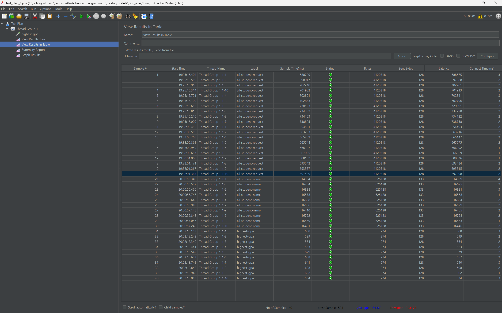
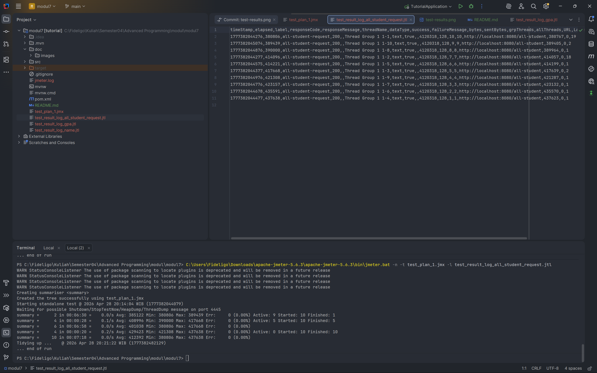
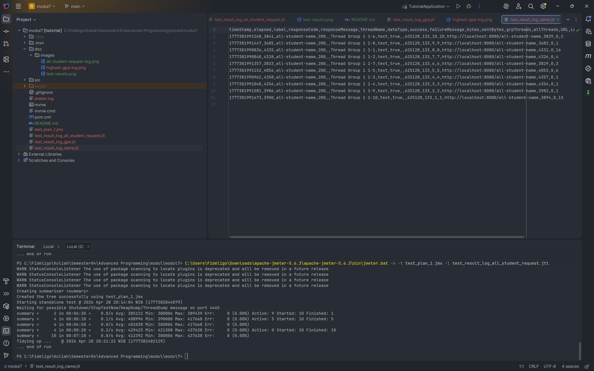
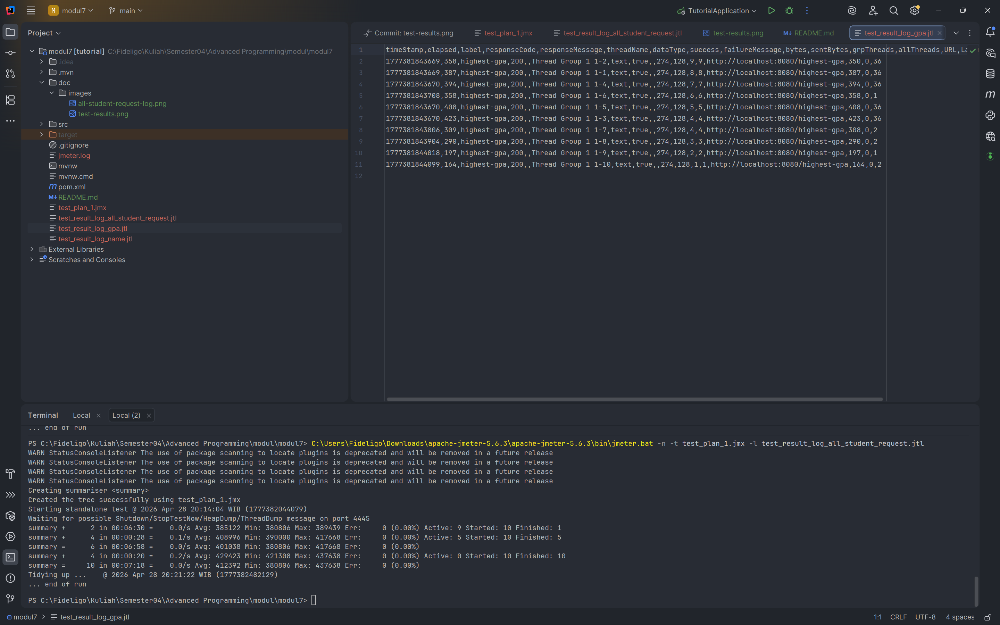
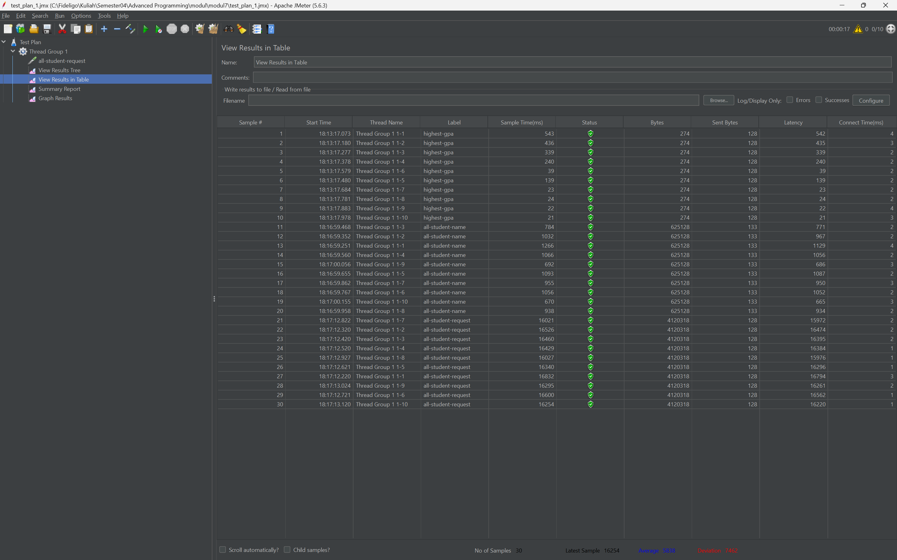

# Reflection - Milestone 1 & 2: Profiling & Performance Analysis

### 1. Observasi Proses Data Seeding
Selama pengerjaan Milestone 1, ditemukan bahwa proses seeding data ke database mengalami kendala performa yang signifikan. Terjadi duplikasi eksekusi yang mengakibatkan jumlah data membengkak menjadi **40.000 mahasiswa** dan **61.174 record** pada tabel `student_courses`.

**Analisis Masalah:**
Proses seeding sangat lambat karena penggunaan `repository.save()` di dalam iterasi loop (N+1 writes). Hal ini menciptakan bottleneck pada I/O disk karena setiap record memicu transaksi database individual.

### 2. Hasil Eksekusi JMeter (Sebelum Optimasi)
Berikut adalah hasil pengujian pada ketiga endpoint dengan beban data ~61k record:

| Nama Sampler | Endpoint | Status | Keterangan |
| --- | --- | --- | --- |
| `all-student-request` | `/all-student` | Success | Paling lambat (hingga ~12 menit) karena payload JSON sangat besar dan adanya N+1 Query. |
| `all-student-name` | `/all-student-name` | Success | Cukup lambat, memproses list String nama mahasiswa. |
| `highest-gpa` | `/highest-gpa` | Success | Cepat secara I/O, namun memicu lonjakan CPU untuk sorting di level Java. |

#### Screenshot Hasil JMeter:

### 3. Analisis Profiling (Hot Spots)
Berdasarkan pengamatan menggunakan Profiling Tool (VisualVM/IntelliJ Profiler):
- **CPU Spikes:** Lonjakan CPU terlihat jelas saat melakukan pencarian mahasiswa dengan IPK tertinggi di antara puluhan ribu data.
- **Memory/Heap Usage:** Penggunaan memori meningkat tajam saat aplikasi mencoba memuat seluruh daftar mahasiswa ke dalam RAM untuk dikirim sebagai response JSON, serta adanya pembuatan objek String secara masif pada endpoint `/all-student-name`.

### 4. Kesimpulan Awal
Profiling membantu mengidentifikasi bahwa pendekatan imperatif sederhana (seperti looping manual) tidak efisien untuk dataset besar. Diperlukan optimasi seperti Batch Processing atau penggunaan query database yang lebih spesifik untuk meningkatkan skalabilitas aplikasi.

### 5. Bukti Eksekusi JMeter melalui Command Line (CLI)
Sesuai dengan instruksi modul, berikut adalah hasil pengujian performa yang dijalankan melalui terminal untuk memverifikasi statistik waktu respon secara mendetail:

#### a. Log Eksekusi: All Student Request
Menunjukkan durasi eksekusi untuk penarikan data lengkap (61k+ records).

#### b. Log Eksekusi: All Student Name
Menunjukkan statistik waktu respon untuk endpoint yang hanya mengembalikan daftar nama.

#### c. Log Eksekusi: Highest GPA
Menunjukkan hasil eksekusi terminal untuk pencarian data tunggal dengan IPK tertinggi.

---

### 6. Milestone 2: Refactoring & Performance Comparison (Sesudah Optimasi)

Setelah mengidentifikasi *bottleneck* melalui IntelliJ Profiler, dilakukan beberapa *refactoring* pada `StudentService.java`:
1.  **Mengatasi N+1 Query (`/all-student`):** Menghapus *looping* pemanggilan database dan menggantinya dengan satu kali eksekusi `studentCourseRepository.findAll()`.
2.  **Database Offloading (`/highest-gpa`):** Memindahkan proses pencarian nilai tertinggi dari memori Java ke eksekusi *query database* (`findFirstByOrderByGpaDesc()`).
3.  **Memory Optimization (`/all-student-name`):** Mengganti penggabungan String (`+=`) yang boros memori dengan `Collectors.joining(", ")` menggunakan Java Stream API.

#### Screenshot Hasil JMeter Setelah Refactoring:

**Konklusi Perbandingan Performa:**
Terjadi peningkatan performa yang sangat drastis dan jauh melampaui target 20%. Waktu eksekusi untuk endpoint terberat (`/all-student`) yang awalnya memakan waktu sekitar **12 menit**, kini berhasil dipangkas menjadi hanya **19 detik**. Endpoint lainnya mengeksekusi data secara instan dalam hitungan millisecond. Hal ini membuktikan bahwa arsitektur kode yang teroptimasi sangat krusial saat menangani volume data berskala besar (61.174 records).

---

### 7. Reflection

**1. What is the difference between the approach of performance testing with JMeter and profiling with IntelliJ Profiler in the context of optimizing application performance?**
JMeter menggunakan pendekatan *black-box testing* (dari luar), di mana ia mensimulasikan beban pengguna nyata untuk mengukur **apa** yang terjadi dan **berapa lama** waktu responnya (seperti metrik *throughput* dan *latency*). Sebaliknya, IntelliJ Profiler menggunakan pendekatan *white-box* (dari dalam) untuk melihat jeroan aplikasi. Profiler tidak mensimulasikan beban, melainkan mengukur **mengapa** dan **di mana** kelambatan itu terjadi pada level kode (mengawasi alokasi *Heap Memory*, penggunaan CPU per *thread*, dan *Call Tree* method).

**2. How does the profiling process help you in identifying and understanding the weak points in your application?**
Profiling mengubah asumsi menjadi data faktual. Alih-alih menebak bagian kode mana yang lambat, visualisasi seperti *Flame Graph* langsung menyorot method yang paling rakus *resource*. Contohnya, pada kasus endpoint `/all-student`, profiler secara eksplisit memperlihatkan bahwa CPU terjebak pada operasi *database fetch* yang berulang-ulang, yang mengonfirmasi adanya *N+1 Query problem* saat memproses 61.174 record data.

**3. Do you think IntelliJ Profiler is effective in assisting you to analyze and identify bottlenecks in your application code?**
Sangat efektif. Profiler terintegrasi langsung dengan IDE, sehingga saya bisa langsung melompat dari balok merah di *Flame Graph* ke baris kode yang bermasalah. Ini jauh lebih efisien dan akurat dibandingkan dengan cara tradisional seperti menaruh `System.currentTimeMillis()` atau `Log.info()` di berbagai tempat secara manual untuk menghitung durasi eksekusi kode.

**4. What are the main challenges you face when conducting performance testing and profiling, and how do you overcome these challenges?**
Tantangan terbesar adalah menangani dataset yang tidak sengaja membengkak (mencapai lebih dari 60.000 record). Saat dites di JMeter, aplikasi memakan waktu hingga 12 menit yang berisiko memicu *timeout* atau *OutOfMemoryError*. Saat di-profiling, grafiknya awalnya sulit dibaca karena tertutup oleh aktivitas *Garbage Collector* bawaan JVM. Cara mengatasinya adalah dengan memastikan target endpoint sudah benar, mengambil *sample* rekaman (recording) dalam durasi singkat (30-60 detik) saat beban sedang memuncak, dan memfilter *Flame Graph* secara spesifik pada *thread* HTTP Tomcat (`http-nio-8080-exec`).

**5. What are the main benefits you gain from using IntelliJ Profiler for profiling your application code?**
Manfaat utamanya adalah visibilitas yang mendalam terhadap interaksi antara Java dan memori. Profiler membantu saya menyadari bahwa hal sepele seperti menggabungkan String menggunakan operator `+=` di dalam *loop* raksasa ternyata memicu *Garbage Collection overhead* yang masif. Profiler memberikan wawasan untuk menulis kode yang lebih *memory-efficient* dan *CPU-friendly*.

**6. How do you handle situations where the results from profiling with IntelliJ Profiler are not entirely consistent with findings from performance testing using JMeter?**
Inkonsistensi sering terjadi karena JMeter juga mengukur faktor eksternal (seperti latensi jaringan atau *database lock*), sedangkan Profiler fokus pada internal JVM. Jika JMeter menunjukkan respon yang lambat namun Profiler menunjukkan CPU/Memori aplikasi sedang menganggur (*idle*), saya akan memperluas cakupan investigasi ke luar kode Java. Saya akan memeriksa performa *I/O disk*, koneksi jaringan, atau melakukan *query profiling* langsung di level PostgreSQL untuk mencari *bottleneck* infrastruktur.

**7. What strategies do you implement in optimizing application code after analyzing results from performance testing and profiling? How do you ensure the changes you make do not affect the application's functionality?**
Strategi optimasi yang diterapkan meliputi:
- **Database Offloading:** Memindahkan logika agregasi atau *sorting* (seperti mencari IPK tertinggi) ke level *query database*.
- **Eager/Batch Fetching:** Mengganti *looping query* dengan satu kali *Bulk Select* untuk membasmi masalah *N+1*.
- **Memory Optimization:** Menggunakan *Stream API* atau `StringBuilder` dibanding *immutable String concatenation*.

Untuk memastikan fungsionalitas tidak berubah setelah *refactoring*, saya menjaga agar struktur *output* data (JSON payload) tetap identik. Hal ini idealnya divalidasi dengan menjalankan *Automated Testing* (Unit atau Integration Tests) untuk memastikan bahwa logika internal baru memberikan nilai balik yang sama persis dengan metode lama.